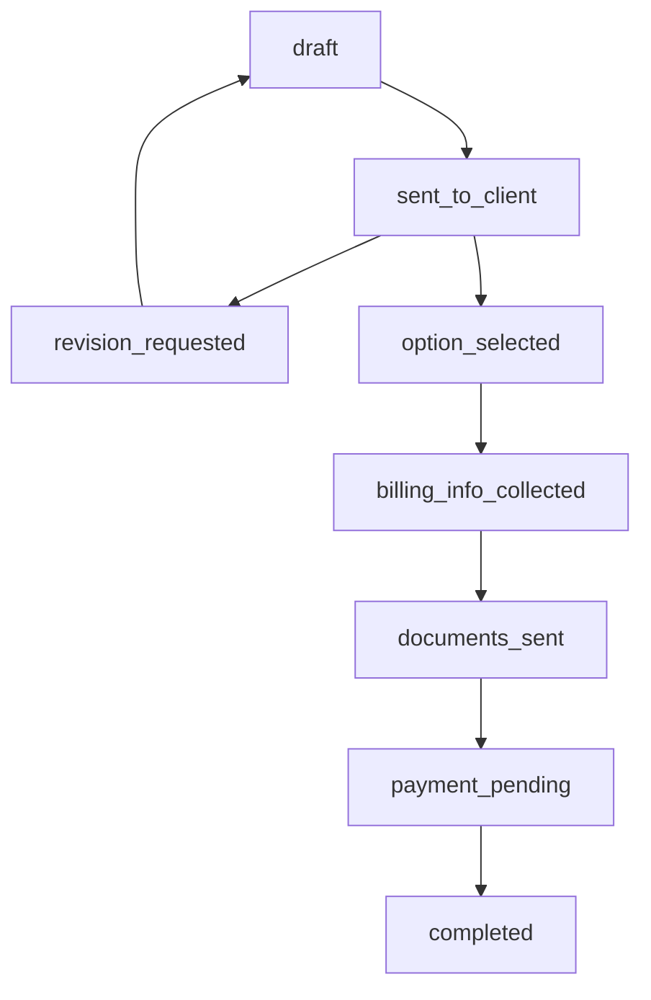

# Plan de Refonte du Système de Propositions

## 1. Analyse de l'Existant

### Structure Actuelle

- **Une proposition = Un contenu unique** (content_json, content_html)
- **Pricing statique** lié directement à la proposition
- **Workflow simple** : Draft → Awaiting Client → Completed/Revision
- **Documents** attachés à la proposition globale
- **Révisions** : Client demande des modifications au photographe

### Limitations

- Pas de choix multiples pour le client
- Informations de facturation manquantes
- Workflow trop rigide
- Pas de séparation claire entre sélection et approbation

## 2. Nouveau Modèle de Données

### Tables à Créer

```sql
-- Options multiples pour chaque proposition
CREATE TABLE proposal_options (
  id UUID PRIMARY KEY DEFAULT gen_random_uuid(),
  proposal_id UUID REFERENCES proposals(id) ON DELETE CASCADE,
  title VARCHAR NOT NULL,
  content_html TEXT,
  content_json JSONB,
  price DECIMAL(10,2) NOT NULL,
  deposit_required BOOLEAN DEFAULT false,
  deposit_amount DECIMAL(10,2),
  is_selected BOOLEAN DEFAULT false,
  order_index INTEGER NOT NULL,
  created_at TIMESTAMPTZ DEFAULT NOW(),
  updated_at TIMESTAMPTZ DEFAULT NOW()
);
```

### Tables à Modifier

```sql
-- Modifier la table proposals
ALTER TABLE proposals
DROP COLUMN content_html,
DROP COLUMN content_json,
DROP COLUMN price,
DROP COLUMN deposit_required,
DROP COLUMN deposit_amount;

-- Ajouter l'option sélectionnée
ALTER TABLE proposals ADD COLUMN selected_option_id UUID REFERENCES proposal_options(id);

-- Nouveaux status
ALTER TYPE status_enum ADD VALUE 'sent_to_client';
ALTER TYPE status_enum ADD VALUE 'option_selected';
ALTER TYPE status_enum ADD VALUE 'billing_info_collected';
ALTER TYPE status_enum ADD VALUE 'documents_sent';
```

## 3. Nouveau Workflow Détaillé

### Étapes Côté Photographe

1. **Création des Options** (`draft`)

   - Créer plusieurs contenus avec pricing différent
   - Prévisualiser chaque option
   - Valider avant envoi

2. **Envoi au Client** (`sent_to_client`)

   - Envoyer toutes les options au client
   - Le client peut voir et comparer

3. **Attente Sélection Client**

   - Le client sélectionne une option et peut demander des révisions
   - Si révision demandée : retour à `revision_requested`
   - Si sélection validée : passage à `option_selected`

4. **Collecte Informations Facturation** (`billing_info_collected`)

   - Demander les informations de facturation au client (mise à jour de la table `clients`)
   - Validation des données

5. **Préparation Documents** (`documents_sent`)

   - Upload contrat/devis basés sur l'option sélectionnée
   - Configuration de l'acompte si souhaité
   - Envoi au client

6. **Finalisation** (`payment_pending` → `completed`)
   - Demande d'acompte si configuré
   - Validation finale par le client

### Étapes Côté Client

1. **Visualisation des Options**

   - Voir toutes les propositions avec pricing
   - Comparer les options

2. **Sélection ou Révision**

   - **Option A** : Choisir une option et valider
   - **Option B** : Demander des révisions avec commentaires

3. **Informations de Facturation** (après sélection validée)

   - Fournir les données de facturation (mise à jour du client)
   - Validation des informations

4. **Documents et Paiement**
   - Consulter les documents finaux
   - Effectuer le paiement si requis ou valider la proposition

## 4. États du Workflow

```typescript
type ProposalStatus =
  | "draft" // Photographe crée les options
  | "sent_to_client" // Options envoyées au client
  | "revision_requested" // Client demande des modifications
  | "option_selected" // Client a choisi une option
  | "billing_info_collected" // Infos facturation récupérées
  | "documents_sent" // Documents et acompte configurés
  | "payment_pending" // En attente de paiement/validation
  | "completed"; // Proposition finalisée
```

### Transitions d'États



## 5. Modifications Techniques

### Backend (API)

```typescript
// Nouveaux endpoints
POST   /api/proposals/:id/options               // Créer une option
PUT    /api/proposals/:id/options/:optionId     // Modifier une option
DELETE /api/proposals/:id/options/:optionId     // Supprimer une option
POST   /api/proposals/:id/send-to-client        // Envoyer au client
POST   /api/proposals/:id/select-option         // Sélection client
POST   /api/proposals/:id/request-revision      // Demande révision client
PUT    /api/clients/:clientId/billing-info      // Informations facturation (table clients)
POST   /api/proposals/:id/upload-documents      // Upload documents
POST   /api/proposals/:id/finalize             // Finalisation
```

### Services

```typescript
// proposalOptionService.ts
class ProposalOptionService {
  async createOption(proposalId: string, option: ProposalOptionData);
  async updateOption(optionId: string, option: Partial<ProposalOptionData>);
  async deleteOption(optionId: string);
  async getProposalOptions(proposalId: string);
}

// clientService.ts (étendu)
class ClientService {
  async updateBillingInfo(clientId: string, billingInfo: ClientBillingData);
  async getBillingInfo(clientId: string);
}
```

### Frontend Components

```typescript
// Nouveaux composants
-ProposalOptionManager.vue - // Gestion des multiples options (photographe)
  ProposalOptionCard.vue - // Carte pour chaque option
  ProposalOptionBuilder.vue - // Builder pour chaque option
  ClientOptionSelector.vue - // Sélection côté client
  ClientBillingForm.vue - // Formulaire facturation (clients)
  ProposalWorkflowStepper.vue - // Nouveau stepper étendu
  ProposalRevisionModal.vue; // Modal pour demande de révision
```

### Types TypeScript

```typescript
interface ProposalOption {
  id: string;
  proposal_id: string;
  title: string;
  content_html: string;
  content_json: NotionBlock[];
  price: number;
  deposit_required: boolean;
  deposit_amount: number | null;
  is_selected: boolean;
  order_index: number;
  created_at: string;
  updated_at: string;
}

interface ClientBillingData {
  company_name?: string;
  first_name?: string;
  last_name?: string;
  billing_email: string;
  billing_phone?: string;
  billing_address?: string;
  billing_city?: string;
  billing_postal?: string;
  billing_country?: string;
  tax_id?: string;
  siret?: string;
}

interface ProposalWithOptions extends Proposal {
  options: ProposalOption[];
  selected_option?: ProposalOption;
  client?: Client; // Contient les infos de facturation
}

interface RevisionRequest {
  option_id?: string; // Révision sur une option spécifique
  comment: string;
  requested_at: string;
}
```

## 6. Plan de Migration

### Étape 1: Base de Données

1. Créer la nouvelle table `proposal_options`
2. Migrer les données existantes :
   ```sql
   -- Migrer les propositions existantes vers proposal_options
   INSERT INTO proposal_options (proposal_id, title, content_html, content_json, price, deposit_required, deposit_amount, is_selected, order_index)
   SELECT id, 'Option Principale', content_html, content_json, price, deposit_required, deposit_amount, true, 1
   FROM proposals
   WHERE content_html IS NOT NULL;
   ```
3. Nettoyer l'ancienne structure dans la table proposals

### Étape 2: Backend

1. Créer les nouveaux services (`ProposalOptionService`, extension de `ClientService`)
2. Créer les nouveaux endpoints
3. Modifier les endpoints existants
4. Mettre à jour les stores Pinia

### Étape 3: Frontend

1. Créer les nouveaux composants
2. Modifier `ProposalSection.vue` pour gérer les multiples options
3. Refactoriser `ProposalForm.vue` en `ProposalOptionManager.vue`
4. Mettre à jour la page client `/proposal/[id].vue`

### Étape 4: Nettoyage du Code Existant

1. **Supprimer tous les composants proposal existants** :

   - `ProposalSection.vue`
   - `ProposalForm.vue`
   - `ProposalContentBuilder.vue`
   - `ProposalDocumentsSection.vue`
   - `ProposalPricingSection.vue`
   - `ProposalActionModals.vue`
   - `ProposalClientView.vue`
   - `ProposalHeader.vue`

2. **Supprimer les services et stores proposal** :

   - `proposalService.ts`
   - `stores/admin/proposal.ts`
   - Endpoints API dans `server/api/proposal/`

3. **Nettoyer les types** :
   - Supprimer les anciens types dans `types/proposal.ts`

### Étape 5: Tests

1. Tests unitaires des nouveaux composants
2. Tests d'intégration du workflow
3. Tests utilisateur end-to-end

## 7. Interface Utilisateur

### Page Photographe - Création de Proposition

```
┌─────────────────────────────────────────────────────────┐
│ Proposition: Shooting Mariage Sarah & Thomas            │
│ Status: [Draft] ●○○○○○○                                 │
├─────────────────────────────────────────────────────────┤
│                                                         │
│ ┌─────────────────────┐ ┌─────────────────────┐        │
│ │ Option 1: Basic     │ │ Option 2: Premium   │        │
│ │ 800€ - 4h shooting  │ │ 1200€ - 6h + album  │        │
│ │ [Modifier] [×]      │ │ [Modifier] [×]      │        │
│ └─────────────────────┘ └─────────────────────┘        │
│                                                         │
│ ┌─────────────────────┐ ┌─────────────────────┐        │
│ │ Option 3: Deluxe    │ │ [+ Nouvelle Option] │        │
│ │ 1800€ - 8h + extras │ │                     │        │
│ │ [Modifier] [×]      │ │                     │        │
│ └─────────────────────┘ └─────────────────────┘        │
│                                                         │
│ [Aperçu Client] [Envoyer au Client]                     │
└─────────────────────────────────────────────────────────┘
```

### Page Client - Sélection d'Option

```
┌─────────────────────────────────────────────────────────┐
│ Proposition de [Photographe] pour votre projet          │
│ Status: En attente de votre choix                       │
├─────────────────────────────────────────────────────────┤
│                                                         │
│ ○ Package Basic - 800€                                  │
│   ┌─────────────────────────────────────────────────┐   │
│   │ • 4h de shooting                                │   │
│   │ • 50 photos retouchées                         │   │
│   │ • Galerie en ligne                             │   │
│   │ [Voir les détails]                             │   │
│   └─────────────────────────────────────────────────┘   │
│                                                         │
│ ● Package Premium - 1200€ [RECOMMANDÉ]                  │
│   ┌─────────────────────────────────────────────────┐   │
│   │ • 6h de shooting                                │   │
│   │ • 100 photos retouchées                        │   │
│   │ • Album photo premium                          │   │
│   │ • Galerie en ligne                             │   │
│   │ [Voir les détails]                             │   │
│   └─────────────────────────────────────────────────┘   │
│                                                         │
│ ○ Package Deluxe - 1800€                               │
│   ┌─────────────────────────────────────────────────┐   │
│   │ • 8h de shooting                                │   │
│   │ • Photos illimitées                            │   │
│   │ • Album premium + tirages                      │   │
│   │ • Séance engagement offerte                    │   │
│   │ [Voir les détails]                             │   │
│   └─────────────────────────────────────────────────┘   │
│                                                         │
│ [Demander des Modifications] [Choisir cette Option]     │
└─────────────────────────────────────────────────────────┘
```

### Page Client - Demande de Révision

```
┌─────────────────────────────────────────────────────────┐
│ Demander des Modifications                               │
├─────────────────────────────────────────────────────────┤
│                                                         │
│ Quelle option vous intéresse le plus ?                  │
│ ○ Package Basic    ● Package Premium    ○ Package Deluxe│
│                                                         │
│ Commentaires et demandes de modification :              │
│ ┌─────────────────────────────────────────────────────┐ │
│ │ J'aimerais avoir le package Premium mais avec      │ │
│ │ 2h de shooting supplémentaires. Est-ce possible    │ │
│ │ d'ajuster le prix en conséquence ?                 │ │
│ │                                                     │ │
│ │ Aussi, pourriez-vous inclure quelques tirages      │ │
│ │ papier dans ce package ?                            │ │
│ └─────────────────────────────────────────────────────┘ │
│                                                         │
│ [Annuler] [Envoyer la Demande]                          │
└─────────────────────────────────────────────────────────┘
```

### Page Photographe - Après Sélection Client

```
┌─────────────────────────────────────────────────────────┐
│ Proposition: Shooting Mariage Sarah & Thomas            │
│ Status: [Option Selected] ●●●○○○○                       │
├─────────────────────────────────────────────────────────┤
│                                                         │
│ ✅ Le client a choisi: Package Premium - 1200€          │
│                                                         │
│ Prochaines étapes:                                      │
│ 1. ○ Collecter les informations de facturation         │
│ 2. ○ Préparer les documents (contrat/devis)            │
│ 3. ○ Configurer l'acompte (optionnel)                  │
│ 4. ○ Finaliser la proposition                          │
│                                                         │
│ [Demander les Infos de Facturation]                     │
└─────────────────────────────────────────────────────────┘
```

### Page Client - Informations de Facturation

```
┌─────────────────────────────────────────────────────────┐
│ Informations de Facturation                             │
│ Package sélectionné: Premium - 1200€                    │
├─────────────────────────────────────────────────────────┤
│                                                         │
│ Type de client:                                         │
│ ● Particulier    ○ Entreprise                           │
│                                                         │
│ Prénom: [Sarah          ] Nom: [Thomas               ]  │
│ Email:  [sarah.thomas@email.com                      ]  │
│ Téléphone: [06 12 34 56 78                           ]  │
│                                                         │
│ Adresse de facturation:                                 │
│ [123 Rue de la Paix                                  ]  │
│ [75001] [Paris        ] [France                      ]  │
│                                                         │
│ [Retour] [Valider les Informations]                     │
└─────────────────────────────────────────────────────────┘
```

## 8. Avantages de la Refonte

### Pour le Photographe

- **Flexibilité commerciale** : Proposer plusieurs formules tarifaires
- **Processus structuré** : Workflow complet de la création au paiement
- **Informations complètes** : Données client collectées automatiquement
- **Professionnalisme** : Présentation claire et organisée
- **Contrôle** : Validation à chaque étape importante

### Pour le Client

- **Choix et transparence** : Plusieurs options clairement présentées
- **Simplicité** : Processus guidé étape par étape
- **Flexibilité** : Possibilité de demander des modifications
- **Sécurité** : Informations de facturation sécurisées
- **Clarté** : Prix et prestations détaillés

## 9. Points d'Attention

### Gestion des Révisions

- Les révisions sont initiées par le client
- Le photographe peut modifier les options en conséquence
- Historique des demandes de révision conservé
- Retour au statut `draft` pour modification

### Migration des Données

- Propositions existantes converties en "Option Principale"
- Pas de perte de données
- Migration progressive possible

### Performance

- Optimisation des requêtes pour charger contenus multiples
- Cache des données de proposition côté client
- Pagination si nombreuses options

Cette refonte transforme le système de propositions en un véritable outil de vente avec un workflow professionnel complet, tout en conservant la flexibilité pour les révisions client.
